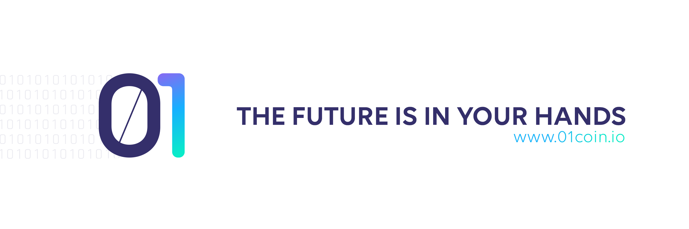

ZeroOne Coin v0.12.1.6
==================================

[WARNING!!! BITCOINTALK 1st dev](https://bitcointalk.org/index.php?topic=2886553.0)

[WARNING!!! INVALID TOPIC!!!!](https://bitcointalk.org/index.php?topic=2885642.0)

What is ZeroOne?
----------------

ZeroOne (ZOC) is an innovative cryptocurrency. A form of digital currency secured by cryptography and issued through a decentralized and advanced mining market. Based on Dash, it's an enhanced and further developed version, featuring the masternode technology with 50% Reward, near-instant and secure payments as well as anonymous transactions. ZeroOne has great potential for rapid growth and expansion. Based on a total Proof of Work and Masternode system, it is accesible to everyone, it ensures a fair and stable return of investment for the Graphics Processing Units (GPUs) miners and the Masternode holders.

License
-------

ZeroOne Core is released under the terms of the MIT license. See [COPYING](COPYING) for more
information or see https://opensource.org/licenses/MIT.

Development Process
-------------------

The `master` branch is meant to be stable. Development is normally done in separate branches.
[Tags](https://github.com/zocteam/zeroonecoin/tags) are created to indicate new official,
stable release versions of ZeroOne Core.

The contribution workflow is described in [CONTRIBUTING.md](CONTRIBUTING.md).

Testing
-------

Testing and code review is the bottleneck for development; we get more pull
requests than we can review and test on short notice. Please be patient and help out by testing
other people's pull requests, and remember this is a security-critical project where any mistake might cost people
lots of money.

### Automated Testing

Developers are strongly encouraged to write [unit tests](/doc/unit-tests.md) for new code, and to
submit new unit tests for old code. Unit tests can be compiled and run
(assuming they weren't disabled in configure) with: `make check`

There are also [regression and integration tests](/qa) of the RPC interface, written
in Python, that are run automatically on the build server.
These tests can be run (if the [test dependencies](/qa) are installed) with: `qa/pull-tester/rpc-tests.py`

The Travis CI system makes sure that every pull request is built for Windows
and Linux, OS X, and that unit and sanity tests are automatically run.

### Manual Quality Assurance (QA) Testing

Changes should be tested by somebody other than the developer who wrote the
code. This is especially important for large or high-risk changes. It is useful
to add a test plan to the pull request description if testing the changes is
not straightforward.
